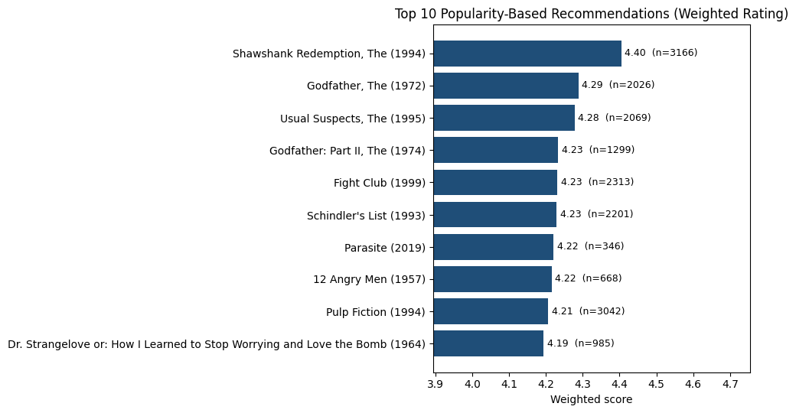

# DSA 4060 – Week 1: Popularity-Based Movie Recommender

A non-personalized movie recommender built with Python and Pandas on the MovieLens latest-small dataset. It provides a transparent baseline that later personalized models can be compared against.

## Objective
Given user–item ratings, rank movies so that a new visitor with no history sees a reliable list of widely liked titles. A movie should not rank first because one user gave it five stars, so the methods combine **average rating** and **number of ratings**.

## Methods
1. **Most rated** – ranks by rating count (visibility, not quality).
2. **Minimum-ratings baseline** – movies with at least 50 ratings, ranked by average rating.
3. **Weighted rating** – `(v/(v+m))·R + (m/(v+m))·C`, where R is the movie average, v its rating count, C the overall mean, and m the 90th-percentile rating count. Sensitivity to other percentiles is tested in the notebook.

## Project Structure
```
dsa4060-week1-recommender/
├── data/                
├── images/
│   └── top10_recommendations.png
├── notebooks/
│   └── week1_popularity_recommender.ipynb
├── .gitignore
├── README.md
└── requirements.txt
```

## Data
MovieLens **latest-small** from GroupLens: https://grouplens.org/datasets/movielens/

1. Download and extract *ml-latest-small.zip*.
2. Copy `movies.csv` and `ratings.csv` into `data/` without renaming columns.

date 28/09/2026
ml-32m


**Attribution:** F. Maxwell Harper and Joseph A. Konstan. 2015. The MovieLens Datasets: History and Context. ACM Transactions on Interactive Intelligent Systems (TiiS) 5, 4, Article 19.

## How to Run
Run all cells top to bottom. On Google Colab, upload the CSVs and change `PROJECT_ROOT` in the notebook's path cell.

## Results
Add your final Top 10 here after running the notebook, and keep the figure below:



## Limitations
- Not personalized: every user receives the same list.
- Popularity bias toward heavily rated movies.
- Results depend on threshold choices (minimum ratings, percentile).
- Only explicit ratings are used.